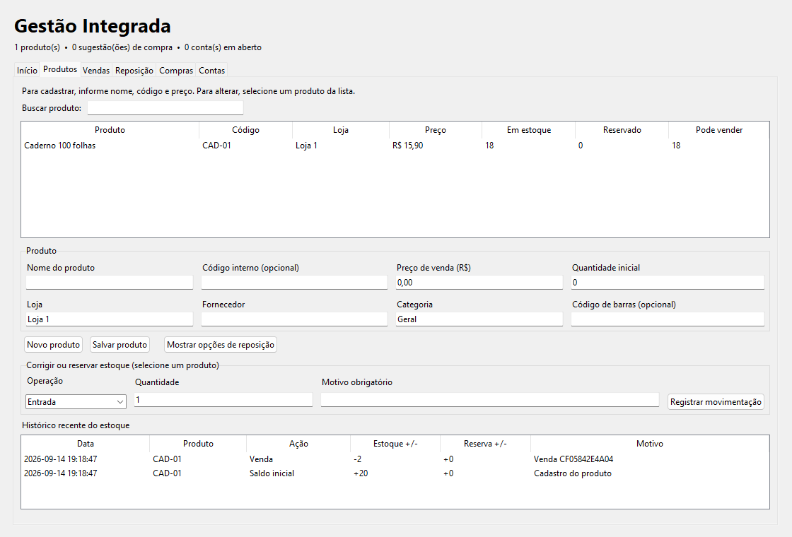

# Gestão Integrada — cadastro, estoque e vendas




Aplicativo único com **Produtos e Estoque, Vendas e Previsão, Reposição, Compras e Contas a Pagar**. Todas as telas usam o mesmo banco SQLite local. Esta versão mantém o fluxo integrado e acrescenta cadastro mais fácil, estoque com reservas e vendas com cancelamento ou devolução.

## Como começar

1. Baixe o ZIP desta versão, extraia os arquivos e abra `executavel/GestaoIntegrada.exe` no Windows. Não precisa instalar Python.
2. Na tela **Início**, clique em **Cadastrar produto**. Informe nome, preço, quantidade inicial e fornecedor. O código interno pode ficar vazio: o programa cria um automaticamente. As regras de reposição ficam em **Mostrar opções de reposição** apenas quando você precisar delas.
3. Clique em **Registrar venda**, escolha o produto e informe a quantidade. O saldo é atualizado na hora. Depois, **Ver reposição** mostra se há sugestão de compra.

Os dados ficam automaticamente em `%LOCALAPPDATA%\GestaoIntegrada\gestao.sqlite3` e permanecem depois de fechar o programa. O ZIP do projeto não contém dados reais.

## Como salvar ou baixar seus dados

Na tela **Início**, clique em **Salvar cópia dos meus dados**, escolha uma pasta (por exemplo, Downloads ou um pen drive) e confirme. O programa cria um ZIP no local escolhido. Ele contém:

- `gestao.sqlite3`: cópia completa para guardar ou restaurar futuramente;
- `planilhas/*.csv`: produtos, vendas, movimentos de estoque, compras e contas, para abrir em Excel ou outro programa;
- `LEIA-ME.txt`: instruções resumidas.

A cópia não é enviada para a internet. Para restaurar, **feche o aplicativo**, extraia `gestao.sqlite3` do ZIP e coloque-o no caminho indicado na tela Início, substituindo o banco atual. Guarde uma cópia do banco atual antes de substituí-lo. Se você já tem registros, salvar uma nova cópia não altera nem apaga os dados do aplicativo.

Para abrir pelo código, instale Python 3.10+ e execute `python main.py` na pasta do projeto. A variável `GESTAO_DB_PATH` permite escolher outro local para o banco.

## Primeiro fluxo completo

1. Na aba **Produtos**, clique em **Novo produto**. Preencha nome, preço, fornecedor e quantidade inicial; clique em **Salvar produto**. O produto aparece na lista imediatamente. Para editar, selecione o produto na lista. A busca encontra nome, SKU e código de barras; o mesmo SKU ou código de barras não pode ser cadastrado duas vezes na loja.
2. Se necessário, registre entradas, saídas, reservas, liberação de reservas ou conferências na aba **Produtos**. Informe sempre o motivo. O histórico mostra cada mudança, e o disponível é o saldo físico menos o reservado.
3. Na aba **Vendas**, informe produto, quantidade, data e preço. A venda baixa o disponível; você pode selecionar a venda para cancelar ou devolver parte das unidades. O estoque e a previsão são corrigidos.
4. Na aba **Reposição**, confira a sugestão. Informe preço e vencimento e crie um pedido. Ele começa como rascunho.
5. Na aba **Compras**, aprove o pedido. A conta a pagar nasce automaticamente. Quando a mercadoria chegar, marque **recebido**: uma entrada é registrada no estoque. Repetir essa ação não duplica a entrada.
6. Na aba **Contas a Pagar**, acompanhe vencimentos e marque a conta como paga.

```text
Venda confirmada → baixa no Estoque → Previsão → Reposição
                                        ↓
                                Pedido de Compra
                                   ↙          ↘
                          Conta a Pagar    Entrega → entrada no Estoque
```

## O que mudou nesta versão

A tela inicial agora mostra o caminho básico de uso e o botão para guardar os dados. O cadastro mostra só os campos essenciais; os ajustes de reposição ficam recolhidos. A lista de produtos prioriza preço e quantidades que importam no dia a dia.

- **Produtos:** busca, edição, categoria, unidade e código de barras, com aviso antes de substituir um SKU existente.
- **Estoque:** saldo físico, reservado e disponível; entradas, saídas, reservas e conferências com motivo e histórico. A reposição considera o disponível.
- **Vendas:** data e preço registrados; cancelamento ou devolução ajustam o estoque e a estimativa de demanda.

As [10 melhorias planejadas](docs/MELHORIAS.md) ficam registradas com o estado de cada uma. As imagens acima contêm **dados fictícios usados apenas para demonstrar a tela**; ao abrir o ZIP pela primeira vez, o cadastro está vazio.

## O que foi unido e o que ainda falta

O saldo tem **uma única fonte**: movimentos de estoque separados por **loja + SKU**. Compras é o único caminho para criar contas financeiras. A Reposição usa vendas recentes, saldo atual e pedidos aprovados ainda não recebidos. A ligação entre telas acontece por serviços Python e transações no mesmo banco; não é preciso manter várias APIs locais ligadas para usar o `.exe`.

Esta versão **ainda não copia todas as funções avançadas** dos cinco repositórios: modelos de previsão mais sofisticados, importação de planilhas, comprovantes, contas recorrentes, vários fornecedores por produto, usuários e permissões. A previsão neste app é uma estimativa simples baseada nas vendas recentes, apresentada como tal. Os repositórios originais permanecem disponíveis como referência enquanto essas funções são trazidas em etapas e testadas. A migração automática dos JSONs antigos também não foi feita; comece com dados novos neste app. Consulte o [plano de evolução](docs/ROADMAP.md) para as próximas funções.

## Estrutura

```text
main.py                 Entrada
gestao/database.py      Banco compartilhado
gestao/backup.py        Cópia completa e planilhas CSV
gestao/catalog.py       Lojas e produtos
gestao/inventory.py     Saldos e movimentos
gestao/forecast.py      Vendas e previsão inicial
gestao/replenishment.py Sugestões de compra
gestao/purchasing.py    Pedidos, aprovação e recebimento
gestao/finance.py       Contas a pagar
gestao/ui.py            Telas de uso diário
tests/                  Fluxos integrados
```

## Testar e gerar outro executável

```powershell
python -m unittest discover -s tests -v
python -m pip install pyinstaller
python -m PyInstaller --onefile --windowed --name GestaoIntegrada main.py
```

O `.exe` gerado fica em `dist/`. O executável incluído no ZIP foi produzido no Windows para esta versão do código.

## Publicar no GitHub

O repositório inclui código, testes, imagem da tela e `executavel/GestaoIntegrada.exe`. O executável está disponível no próprio repositório para facilitar a avaliação. Nas próximas versões, podemos transferir os binários para **Releases** e manter o histórico do código mais leve.
