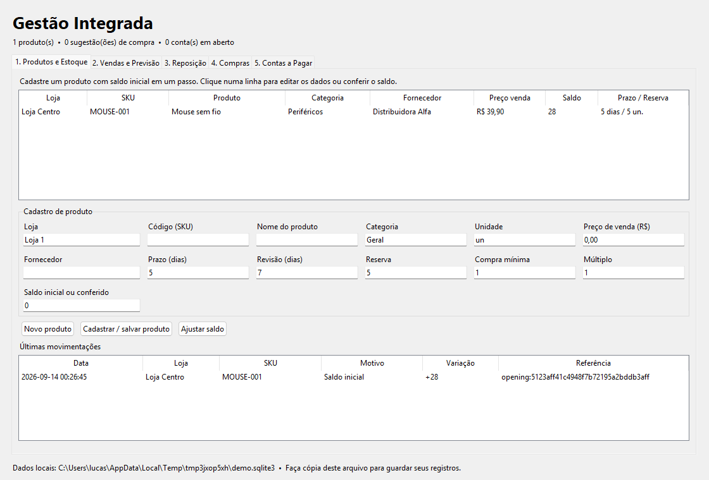

# Gestão Integrada — primeira versão desktop



Aplicativo único com **Produtos e Estoque, Vendas e Previsão, Reposição, Compras e Contas a Pagar**. Todas as telas usam o mesmo banco SQLite local. O objetivo desta versão é validar o fluxo completo com regras compartilhadas antes de trazer funções avançadas dos projetos individuais.

## Abrir

- **Windows sem Python:** abra `GestaoIntegrada.exe` dentro da pasta `executavel` do ZIP. O primeiro início pode levar alguns segundos.
- **Pelo código:** instale Python 3.10+ e execute `python main.py` na pasta do projeto. Não há dependências para usar a aplicação.

Os dados são salvos em `%LOCALAPPDATA%\GestaoIntegrada\gestao.sqlite3` e permanecem após fechar o programa. O executável e o código usam esse mesmo arquivo. Faça uma cópia dele para guardar seus registros. Para usar outro local, defina a variável `GESTAO_DB_PATH` antes de abrir a aplicação. O ZIP **não contém dados reais** e começa com as tabelas vazias.

## Primeiro fluxo completo

1. Na aba **Produtos e Estoque**, clique em **Novo produto**. Preencha loja, SKU, nome, categoria, unidade, preço de venda, fornecedor e saldo inicial; clique em **Cadastrar / salvar produto**. O produto aparece na lista imediatamente. **Ajustar saldo** serve para conferências posteriores.
2. Na aba **Vendas e Previsão**, registre uma venda. O estoque baixa imediatamente; a previsão inicial mostra uma média dos últimos 30 dias.
3. Na aba **Reposição**, confira a sugestão. Informe preço e vencimento e crie um pedido. Ele começa como rascunho.
4. Na aba **Compras**, aprove o pedido. A conta a pagar nasce automaticamente. Quando a mercadoria chegar, marque **recebido**: uma entrada é registrada no estoque. Repetir essa ação não duplica a entrada.
5. Na aba **Contas a Pagar**, acompanhe vencimentos e marque a conta como paga.

```text
Venda confirmada → baixa no Estoque → Previsão → Reposição
                                        ↓
                                Pedido de Compra
                                   ↙          ↘
                          Conta a Pagar    Entrega → entrada no Estoque
```

## O que foi unido e o que ainda falta

O saldo tem **uma única fonte**: movimentos de estoque separados por **loja + SKU**. Compras é o único caminho para criar contas financeiras. A Reposição usa vendas recentes, saldo atual e pedidos aprovados ainda não recebidos. A ligação entre telas acontece por serviços Python e transações no mesmo banco; não é preciso manter várias APIs locais ligadas para usar o `.exe`.

Esta primeira versão **ainda não copia todas as funções avançadas** dos cinco repositórios: modelos de previsão mais sofisticados, importação de planilhas, comprovantes, contas recorrentes, vários fornecedores por produto, usuários e permissões. A previsão neste app é uma estimativa simples baseada nas vendas recentes, apresentada como tal. Os repositórios originais permanecem disponíveis como referência enquanto essas funções são trazidas em etapas e testadas. A migração automática dos JSONs antigos também não foi feita; comece com dados novos neste app. Consulte o [plano de evolução](docs/ROADMAP.md) para as próximas funções.

## Estrutura

```text
main.py                 Entrada
gestao/database.py      Banco compartilhado
gestao/catalog.py       Lojas e produtos
gestao/inventory.py     Saldos e movimentos
gestao/forecast.py      Vendas e previsão inicial
gestao/replenishment.py Sugestões de compra
gestao/purchasing.py    Pedidos, aprovação e recebimento
gestao/finance.py       Contas a pagar
gestao/ui.py            As cinco telas
tests/                  Fluxos integrados
```

## Testar e gerar outro executável

```powershell
python -m unittest discover -s tests -v
python -m pip install pyinstaller
python -m PyInstaller --onefile --windowed --name GestaoIntegrada main.py
```

O `.exe` gerado fica em `dist/`. O executável incluído no ZIP foi produzido no Windows para esta versão do código.

## Publicar no GitHub

Esta primeira publicação inclui código, testes, imagem da tela e `executavel/GestaoIntegrada.exe`. O executável está disponível no próprio repositório para facilitar a avaliação. Nas próximas versões, podemos transferir os binários para **Releases** e manter o histórico do código mais leve.
